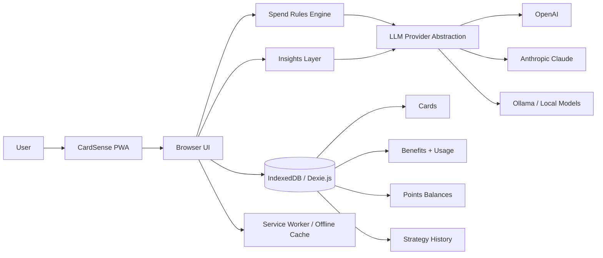

# CardSense

**A local-first credit card benefits and strategy dashboard that helps users get more value from the cards already in their wallet.**

> **Portfolio project** · Source code is maintained in a private repository.

CardSense brings card benefits, points balances, usage history, and purchase recommendations into one place. Instead of checking multiple issuer apps or trying to remember which card is best for a purchase, users can track their wallet and get a recommendation based on their cards, benefits, and spending rules.

The application is designed around a simple privacy principle: **personal card data stays in the browser by default.**

---

## What it does

- **Benefit tracking** — view benefits across cards, track usage, and see reset periods
- **Points tracking** — maintain points and miles balances across issuers
- **Card recommendations** — ask which card to use for a purchase or category
- **AI-assisted insights** — generate benefit summaries, card cheat sheets, annual-fee ROI analysis, redemption ideas, and timing reminders
- **Card management** — maintain a personal wallet and refresh card benefit information
- **History** — review previously logged benefit usage and strategy sessions
- **Portable data** — export and import the wallet as JSON
- **Offline-friendly PWA** — core wallet data remains available without an active connection

---

## Architecture

### Local-first design

CardSense does not require a traditional application database for personal wallet information. User data is persisted in **IndexedDB** through **Dexie.js**, keeping the primary data model on-device.

LLM requests are made only when a user invokes an AI-powered capability.

---

## Engineering highlights

### 1. Local-first data model

The application uses IndexedDB as its primary persistence layer rather than storing wallet data on an application server.

This keeps the architecture lightweight while giving users durable browser storage for cards, benefits, benefit usage, points balances, strategy history, and settings.

### 2. Multi-provider LLM integration

AI functionality is behind a provider abstraction so the product is not tied to a single model vendor. Supported integrations include OpenAI, Anthropic Claude, and Ollama / local models.

That abstraction is used by features such as benefit refreshes, purchase recommendations, and wallet insights.

### 3. Hybrid recommendation approach

Card recommendations combine structured spending rules with LLM reasoning rather than treating every purchase as an unconstrained AI prompt.

This makes the recommendation flow easier to reason about while still allowing natural-language questions.

### 4. Offline-capable PWA

A service worker caches the application shell so users can continue viewing their wallet when offline. Features that require an LLM naturally require connectivity, while local wallet data remains available.

### 5. Data portability

Users can export a complete JSON snapshot and later restore it, making the local-first storage model portable rather than locking information to one browser session.

---

## Tech stack

| Area | Technology |
|---|---|
| Frontend | HTML, JavaScript, Tailwind CSS |
| Client storage | IndexedDB, Dexie.js |
| AI integrations | OpenAI, Anthropic Claude, Ollama |
| Recommendation logic | JavaScript rules engine + LLM layer |
| Offline support | Service Worker, Web App Manifest |
| Local development | Flask static server |
| Deployment | Static web hosting / PWA |

---

## Product areas

### Wallet & Cards
Maintain the cards in a user's wallet and the benefits associated with each product.

### Benefits
Track whether recurring credits or card benefits have been used and when they reset.

### Points
Keep a lightweight record of points and miles balances across loyalty programs.

### Strategy
Ask questions such as:

- Which card should I use for groceries?
- Which card is strongest for travel?
- Which benefit am I about to lose?
- Are my annual fees justified by the value I'm getting?

### Insights
Generate higher-level views of the wallet, including benefit digest, spend-category cheat sheet, annual-fee ROI, benefit timing calendar, points redemption ideas, and strategy history.

---

## Screenshots

Screenshots will be added here without exposing application source code.

Recommended captures: dashboard, benefits, card strategy, AI insights, and mobile/PWA view.

---

## What I focused on

This project gave me a chance to work across product design and implementation rather than building an isolated technical demo.

The main engineering problems I focused on were:

- designing a browser-first data model
- keeping personal wallet data local
- creating a clean abstraction across multiple LLM providers
- combining deterministic card rules with AI-assisted reasoning
- supporting offline use without introducing unnecessary backend infrastructure
- turning a fairly complex set of card benefits into a usable day-to-day interface

---

## Future improvements

- optional encrypted account sync across devices
- automated issuer/card-data ingestion
- stronger deterministic validation of AI-generated benefit data
- more advanced reward valuation and redemption modeling
- notification support for benefits approaching expiration
- automated test coverage for recommendation rules and data migrations

---

## Source code

The production source code is kept in a **private repository**.

This public repository is intentionally limited to project documentation, architecture, screenshots, and product/engineering context.

**Source access can be provided during an interview or technical review when appropriate.**
